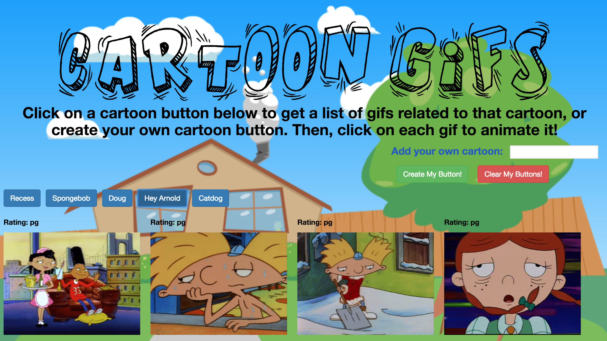

# GiphyApi

Link to site: https://sefeder.github.io/GiphyApi/

This website allows users to click on one of the given cartoon buttons and will return a list of 10 gifs related to that cartoon from GIPHY. Additionally, users can add their own cartoon button and then have 10 gifs related to that cartoon returned. Upon clicking each gif, it will animate if it's still and it will become still if it's animated. The site utilizes ajax requests to GIPHY's API.

Technology Used:

HTML, 
CSS/Bootstrap, 
JavaScript, 
JQuery, 
AJAX Requests/APIs,

Future Versions:

Future versions of this site will improve upon readability and styling and will add increased functionality to the returned gifs. 